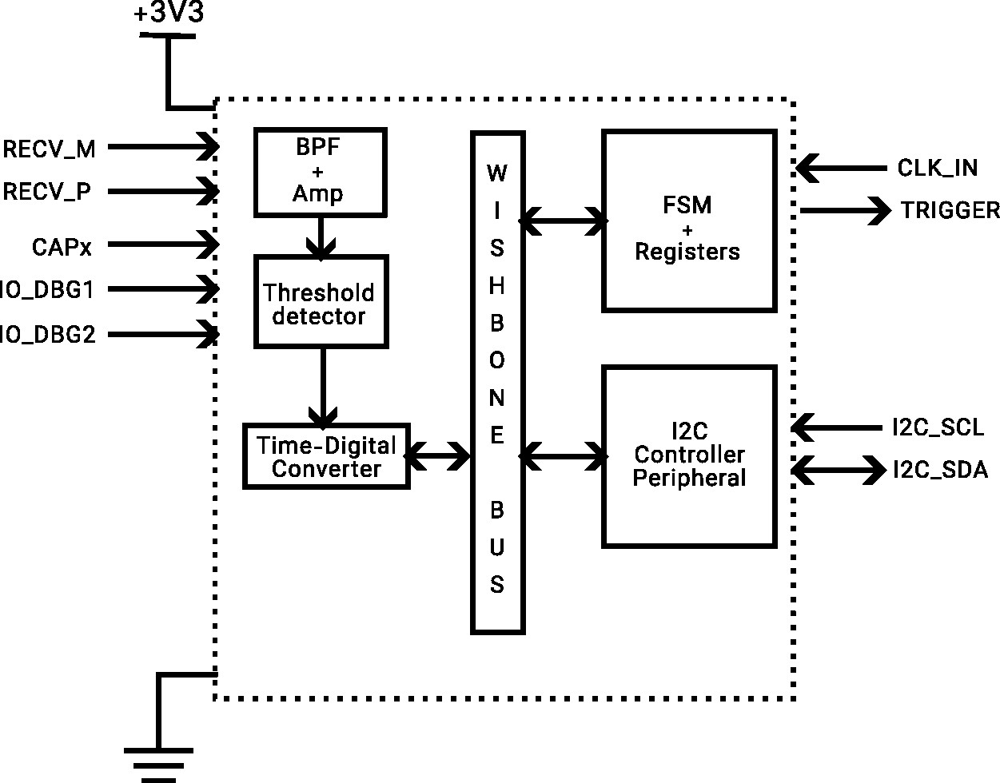

# Team B05: Ultrasonic Array Receiver for Doppler Velocity Logger
###  Chipathon 2026 Track B

Welcome to the team B05 Acoustic Ranger repository!
This is our codebase containing all analog and digital designs for the Chipathon 2026 Track B: Circuits for Sensors Chip Design Contest

Here are our team members: 
- Raditya (discord: @Raditya Putra, Team Leader, Digital)
- Yuan (discord: @ClearAtomic, Team Member, Digital)
- Farhan (discord: @nexuzium, Team Member, Analog)
- Raihan (discord: @sergeyv, Team Member, Analog)
- Faiz (discord: @faizzsk, Team Member, Analog)

Want to know about our design? Please read the short version below: 
### Overview
A DVL (Doppler Velocity Logger) is a sensor capable of both ranging and measuring speed, using the properties of sound and the Doppler Effect. This kind of sensor enables the user to know their distance relative to the surrounding environment and their speed by using a sound source. Due to its acoustic-based working principle, it is ubiquitous in underwater robotic applications where lights and RF signals cannot penetrate easily. 

However, DVL hardware is notoriously expensive, especially if only for trial/testing/low-budget purposes, particularly for use in teaching environments and student robotic clubs. Here, we aim to understand how the sensor works and replicate it in an IC package that hopefully will perform well enough, be compact and integrated, and have the potential to be reused. 

### Design Overview
 

### Technical Specifications
#### Electrical Characteristics (General)
|Specification|Value|Units|Note|
|:---:|:---:|:---:|:---:|
|Supply Voltage (Vdd)|3.3|V|GF180MCU Typical|
|Input/Output Voltage|3.3|V|not larger than Vdd|
|Source/Sink Strength|2-4|mA|At least 2 mA, applies to digital pin|
|Input Pin Impedance|TBA|&Omega;|TBA|
|Operating Temperature|0 - 70|°C|commercial-grade operating temperature|

#### Electrical Characteristics (Analog)
|Specification|Value|Units|Note|
|:---:|:---:|:---:|:---:|
|Sensor Bandwith|250K|Hz|Based on certain DVL model as reference|
|Sensor Bandwith|&plusmn; 3K|Hz|Based on doppler calculator|
|Ranging Resolution|1|cm/s|-|
|Detector Threshold Value|1.5|V|Half of Design Vdd|

#### Communications
|Specification|Value|Units|Note|
|:---:|:---:|:---:|:---:|
|Communication Protocol|I2C|-|-|
|Maximum Comms Frequency (fmax)|400K|Hz|I2C Fast Mode|
|Pin Drive Mode|Open-Drain|-|Per I2C specification|

### Timeline
TBA

---
### Further Links
- Repo: https://github.com/radityankn/acoustic-ranger-dvl-processor
- Proposal: https://docs.google.com/document/d/15CWtgfbUH-VdxXho_lQxhmdTbqlXZ5-lwGtx0uzNP28/edit?usp=sharing
- Timeline: https://docs.google.com/spreadsheets/d/1OjBXcoXG4r3dMwi6IN1rT7X0Q9pT_t6VHbT_zbCJD7A/edit?usp=drivesdk
